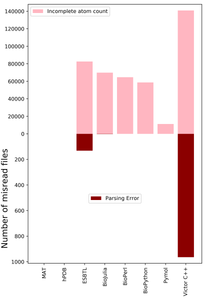

## Benchmarking the parsing of complete PDB database with the atom count

For evaluating the performance and speed of our MAT parser we have used the whole PDB  (https://www.rcsb.org/) database. These files were downlaoded on Nov 21, 2018. A total number of 145787 files were parsed and tested.

## Comparison among programs
For comparison, we have taken following tools and programs:
* BioJulia https://biojulia.net/
* BioPerl https://bioperl.org/
* BioPython https://biopython.org
* ESBTL (Easy Structural Biology Template Library) http://esbtl.sourceforge.net
* hpdb http://hackage.haskell.org/package/hPDB
* MAT (Macromolecular Analysis Toolkit) http://mat.iitr.ac.in 
* Pymol https://pymol.org
* Victor C++ http://protein.bio.unipd.it/victor/index.php/Main_Page

The plot for time taken to parse the whole database.  

Interesting results were seen when we counted the number of atoms. 
Considering a large number of files that were not being able to parse by ESBTL and Victor C++ library, we have made an effort to look into a few files randomly to see the errors:
###ESBTL
*2vp1
../pdb2vp1.ent, Fatal error: Cannot extract field 'charge' in 
<|HETATM 4905  O2S MES B1349     -33.957   7.728 -54.813  1.00 41.36           O-1|>
*5fux
../pdb5fux.ent, Fatal error: Cannot extract field 'charge' in 
<|HETATM 2588 ZN    ZN A1386     -22.105 -28.075   3.014  1.00 52.96          ZN+2|>
*pdb3zhv.ent
../pdb3zhv.ent, Fatal error: Cannot extract field 'charge' in 
<|HETATM25082 MG    MG A2002      -3.402  18.399 -47.244  1.00 27.31          MG+2|>

This lead us to believe that ESBTL throws a fatal error when it is unable to extract 'charge'. Hopefully, this can be corrected in coming updates of the software.

###Victor C++
*1a1d
Segmentation fault (core dumped)
6hg5, 1w0s, 2aar, 2agt, 2auu, and 4kan also encountered segfaults, therefore, the exact reason for these errors are unknown.

